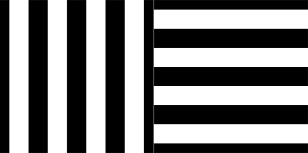
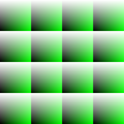

# Gray-Code Structured Light utilities

Application case：https://robot9.me/autostereoscopy-3d-test/

## Build

```
mkdir build
cd build
cmake ..
make
```

## Usage

### encode pattern



```cpp
GrayCode gray(1024, 1024);

for (int i = 0; i < gray.getBitsX(); i++) {
    cv::Mat image = gray.encodePattern(i, Horizontal);
    sprintf(name, "gray_h_%d.jpg", i);
    cv::imwrite(name, image);
    cv::imshow(name, image);

    cv::waitKey();
}

for (int i = 0; i < gray.getBitsY(); i++) {
    cv::Mat image = gray.encodePattern(i, Vertical);
    sprintf(name, "gray_v_%d.jpg", i);
    cv::imwrite(name, image);
    cv::imshow(name, image);

    cv::waitKey();
}
```

### decode pattern



```cpp
std::vector<cv::Mat> imagesH, imagesV;

for (int i = 0; i < 10; i++) {
    sprintf(name, "gray_h_%d.jpg", i);
    cv::Mat img = cv::imread(name);
    imagesH.push_back(img);
}

for (int i = 0; i < 10; i++) {
    sprintf(name, "gray_v_%d.jpg", i);
    cv::Mat img = cv::imread(name);
    imagesV.push_back(img);
}

cv::Mat pattern;
GrayCode::decodePattern(imagesH, imagesV, pattern);

// pattern -> texture
cv::Mat texture = GrayCode::pattern2Texture(pattern);
cv::imshow("texture", texture);

// no compression
std::vector<int> compression_params;
compression_params.push_back(CV_IMWRITE_PNG_COMPRESSION);
compression_params.push_back(0);

cv::imwrite("texture.png", texture, compression_params);
CvUtils::writeMatToFile(texture, "texture.txt");

cv::waitKey();
```

## License
This code is licensed under the MIT License (see [LICENSE](LICENSE)).
